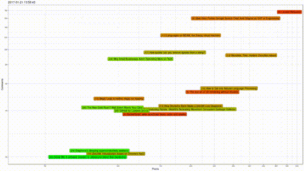

# Hacker News visualizations

This repo contains Python and R scripts related to my experiment I wrote about [on my blog](https://blog.netdecorator.org/2017/09/visualizing-the-hacker-news-frontpage.html).

`collector.py` uses Python3.6 with requests, BeautifoulSoup and lxml to periodically collect JSON snapshots of the Hacker News front page.

`analyzer.R` uses R with jsonlite and ggplot2 to produce PNG graph images from the produced JSON files.

Rendering the PNGs into a full video then looks like this: 

